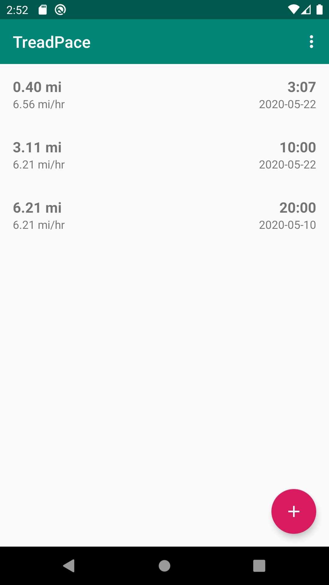
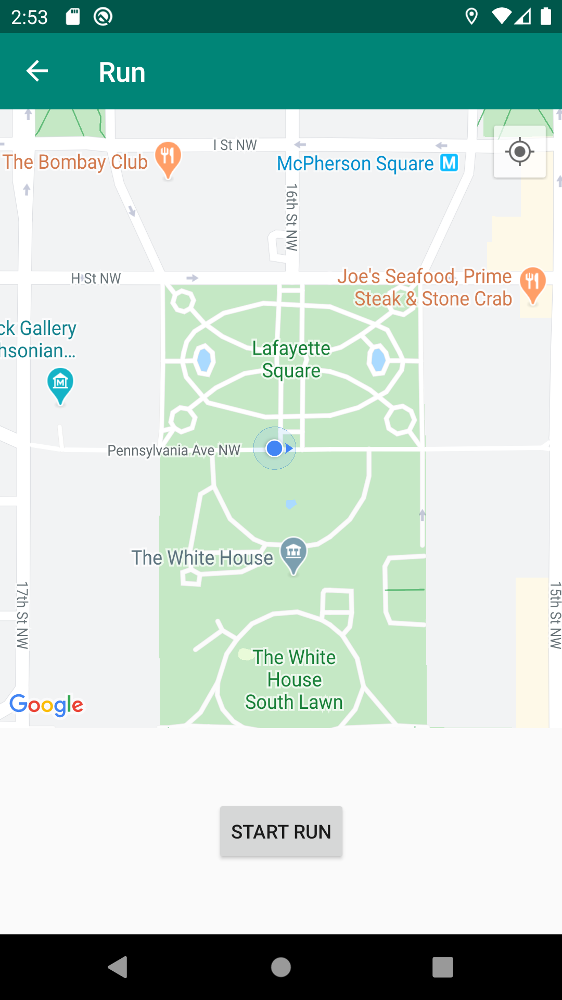
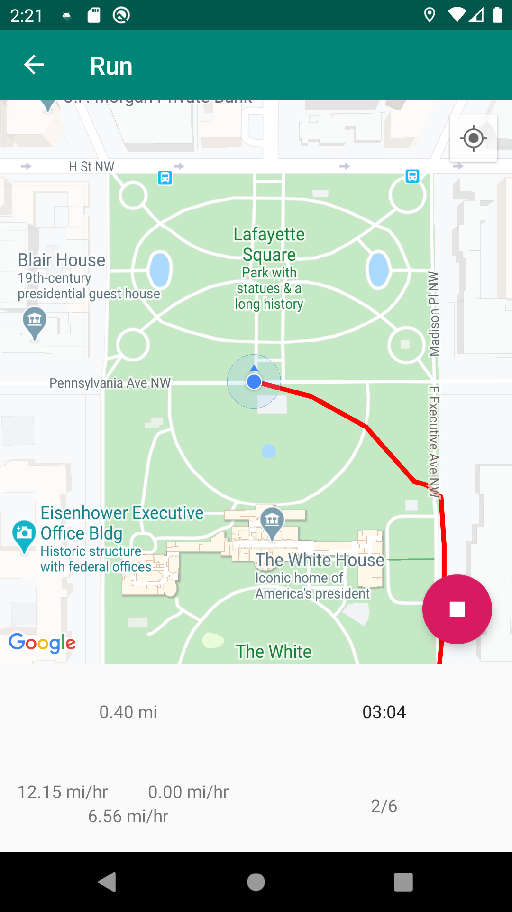
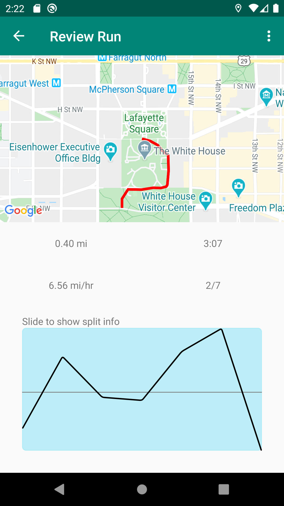

# TreadPace

## Introduction

TreadPace is a GPS running application for android that tracks the beginning of a user's run and uses that as their baseline "treadmill" pace for the duration of the run.

## Installation

TreadPace is (soon to be) available on the Google Play store. To install & run TreadPace yourself, the repository can be cloned and an XML string resource named GoogleMapsAPIKey can be created that has the Google Maps SDK for Android enabled.

## Overview

TreadPace seeks to bridge the gap between running on the treadmill versus running outside. On a treadmill, a user is able is set their pace andknow that they're consistently running at the same speed for the duration of the run. However, when you run outside, you can be bogged down by wind or hills and lose track of the pace you set out to run initially. 

TreadPace bridges this gap by taking the first three splits (roughly 30 seconds) of a person's run and uses that as their "treadmill pace" that is used as a baseline for the duration of the run. The user will know how many splits they ran in the duration of their run and can see their pace throughout the run in respect to the map.

## Screenshots

  
  

